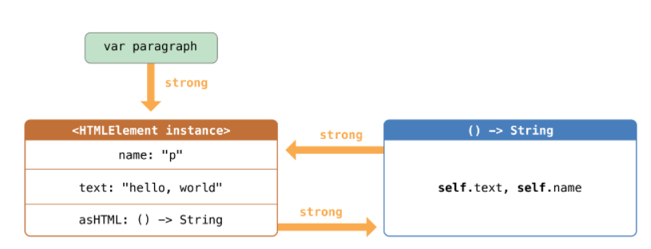

책으로 공부

## Automatic Reference Counting
인스턴스가 더 이상 필요 없으면 ARC가 자동으로 메모리에서 해제한다.

*클로저에서 강한 참조로 생성된 무언가를 다시 또 강한 참조 하지 않게 하는 일은 매우 중요하다.*

#### Strong Reference Cycles for Closures
클로저를 클래스 인스턴스의 프로퍼티에 할당하고 그 클로저의 본문이 인스턴스를 캡쳐하면 강한참조 순환이 발생할 수 있다.
이런 강한 순환참조는 클로저, 클래스와 같은 참조타입에서 발생할 수 있다. 클로저를 프로퍼티에 할당할 때, 레퍼런스를 할당하는 것이다.

* 강한 순환참조 문제 해결법 : closure capture list

* 강한 순환참조 예제

```swift
class HTMLElement {

    // name indicated the name of the element such as "h1" heading element ..
    let name: String
    let text: String?

    // asHTML references a closure
    /*
     asHTML 프로퍼티는 이름이 부여되고 인스턴스 메서드처럼 사용되긴하지만 인스턴스메서드보단 클로저 '프로퍼티'기 때문에 default value(기본값)을 custom closure로 대체할 수 있다.
     */
    lazy var asHTML: () -> String = {
        if let text = self.text {
            return "<\(self.name)>\(text)</\(self.name)>"
        } else {
            return "<\(self.name) />"
        }
    }

    init(name: String, text: String? = nil) {
        self.name = name
        self.text = text
    }

    deinit {
        print("\(name) is being deinitialized")
    }
}

let heading = HTMLElement(name: "h1")
let defaultText = "some default text"
heading.asHTML = {
    return "<\(heading.name)>\(heading.text ?? defaultText)</\(heading.name)>"
}
print(heading.asHTML())

// HTMLElement 클래스가 새로운 인스턴스를 만들고 출력하는 법
var paragraph: HTMLElement? = HTMLElement(name: "p", text: "hello, world")
print(paragraph!.asHTML())
// Prints "<p>hello, world</p>"
```

* 위 코드 중 아래 블록에서 HTMLElement이 HTMLElement인스턴스와 asHTML의 기본값으로 설정된 클로저 사이에 강한 순환 참조를 발생시키고 있다.

  

만약 paragraph 변수를 nil로 설정하고, 이 HTMLElement에 대한 강한 참조를 파괴하면, HTMLElement인스턴스나 그 클로저는 할당해제 되지 않는다. 강한 참조순환이 있기 때문이다.
```swift
paragraph = nil
```
이렇게 해도 HTMLElement의 디이니셜라이저가 호출되지 않는 것을 볼 수 있다. HTMLElement인스턴스가 할당해제 되지 않았다.
