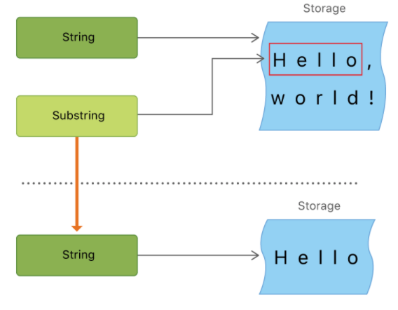

* 스위프트의 String type은 Foundation의 NSString class와 연결되어 있다. -> 만약에 Foundation을 import하면 String에서 NsString 메서드를 사용할 수 있다(casting 없이).

#### String Literals
* Special Characters in String Literals
    - `\0` : null character
    - `\\` : backslash
    - `\t` : horizontal tab
    - `\n` : line feed
    - `\r` : carriage return
    - `\"` : double quote
    - `\'` : single quote

#### Initializing an Empty String
```swift
var emptyString = "" // empty string literal
var anotherEmptyString = String() // initializer syntax

// Find out whether a String value is empty by checking its Boolean `isEmpty` property
if emptyString.isEmpty {
  print("Nothing to see here")
}
```

#### String Mutability
```swift
var variableString = "Horse"
variableString += " and carriage"
```

#### String Are Value Types
* 스위프트에서 String은 참조타입이 아닌 값타입
* 스위프트 컴파일러는 문자열 사용을 최적화하여 실제 복사가 절대적으로 필요한 경우에만 복사한다.(성능이 좋음)

#### Working with Characters
> let exclmationMark: Character = "!"

#### Concatenating Strings and Characters
```swift
let string1 = "hello"
let string2 = " there"
var welcome = string1 + string2
```
* Character value를 String variable에 append 시킬 수 있음
```swift
let exclmationMark: Character = "!"
welcome.append(exclmationMark)
```

#### String Interpolation
```swift
let multiplier = 3
let message = "\(multiplier) times 2.5 is \(Double(multiplier) * 2.5)"
```

#### Unicode (내용이 조금 이해안감 다시 계속 볼 것)
* Unicode is an international standard for encoding, representing, and processing text in different writing systems.
* 스위프트의 네이티브 문자열 타입은 Unicode Scalars(21-bit)에서 만들어졌다.
* Extended Grapheme Clusters
    - 스위프트의 Character 타입의 모든 인스턴스는 single extended grapheme clutser를 나타낸다.
    - extended grapheme clutser는 유니코드 스칼라의 순서로 사람이 읽을 수 있는 문자를 만든다.
    ```swift
    let precomposed: Character = "\u{D55C}"                  // 한
    let decomposed: Character = "\u{1112}\u{1161}\u{11AB}"   // ᄒ, ㅏ, ㄴ  
    // 둘의 결과는 '한'으로 같음
    ```

#### Counting Characters(예제 중요!)
* 스위프트에서 extended grapheme clusters를 사용하는것을 잊지말 것
```swift
var word = "cafe"
print("the number of characters in \(word) is \(word.count)")
// Prints "the number of characters in cafe is 4"

word += "\u{301}"    // COMBINING ACUTE ACCENT, U+0301

print("the number of characters in \(word) is \(word.count)")
// Prints "the number of characters in café is 4"
```

#### Accessing and Modifying a String
* 스위프트 String은 Int값으로 인덱싱할 수 없다. (문자마다 다른 양의 메모리가 필요하고 어떤 문자가 특정 위치에 있는지 판별하려면 해당 문자열의 시작 또는 끝에서 각 유니코드 스칼라를 반복해야 한다.)
* property: `startIndex`, `endIndex` (비어있는 String -> startIndex와 endIndex가 같다. endIndex는 마지막 문자 다음 position)
* method: `index(before:)`, `index(after:)`, `index(_:offsetBy:)`
```swift
let greeting = "Guten Tag!"
greeting[greeting.startIndex]
// G
greeting[greeting.index(before: greeting.endIndex)]
// !
greeting[greeting.index(after: greeting.startIndex)]
// u
let index = greeting.index(greeting.startIndex, offsetBy: 7)
greeting[index]
// a
```
* String의 모든 문자열의 인덱스에 접근하기 : `indices`
    ```swift
    for index in greeting.indices {
        print("\(greeting[index]) ", terminator: "")
    }
    // Prints "G u t e n   T a g ! "
    ```
* Collection 프로토콜을 준수하는 모든 타입에 대해서 startIndex, endIndex 프로퍼티와 index(before:), index(after:), `index(_:offsetBy:)`메소들을 사용할 수 있다.
* Inserting and Removing
    ```swift
    var welcome = "hello"
    welcome.insert("!", at: welcome.endIndex)
    // welcome now equals "hello!"

    welcome.insert(contentsOf: " There", at: welcome.index(before: welcome.endIndex))
    // welcome now equals "hello there!"

    welcome.remove(at: welcome.index(before: welcome.endIndex))
    // welcome now equals "hello there"

    let range = welcome.index(welcome.endIndex, offsetBy: -6)..<welcome.endIndex
    welcome.removeSubrange(range)
    // welcome now equals "hello"
    ```
    - `insert(_:at:), insert(contentsOf:at:), remove(at:),removeSubrange(_:)`메서드는 RangeReplaceableCollection 프로토콜을 준수하는 타입에서 사용가능
* Substrings
    ```swift
    let greeting = "Hello world!"
    let index = greeting.index(of: ",") ?? greeting.dendIndex
    let beginning = greeting[..<index]
    // beginning is "Hello"

    // Convert the result to a String for long-term storage.
    let newString = String(beginning)
    ```
    - 문자열에 대한 작업 중 잠깐동안만 substring을 사용
    - 오랫동안 저장할 준비가 될때 위 코드처럼 substring을 String의 인스턴스로 변환해서 사용
    
    - substring은 원래 문자열을 저장하는데 사용되는 메모리의 일부를 다시 사용할 수 있다.(for 성능최적화 -> 문자열이나 substring을 수정할 때까지 추가적으로 메모리를 복사해야되는 cost를 줄일 수 있다.) 이와 같은 이유 때문에 오래 저장하는것에 대해서 오래 유지되어야한다면 String인스턴스로 다시 저장해서 사용
* String, Substring은 모두 `StringProtocol`을 준수. 문자열을 조작하는 함수가 StringProtocol value를 받아들일 때 편리하다. 이런 함수는 String 또는 SubString value로 호출할 수 있다.

#### Comparing Strings
* textual value 비교 3가지 방법
    1. string and character equality
        ```swift
        let quotation = "We're a lot alike, you and I."
        let sameQuotation = "We're a lot alike, you and I."
        if quotation == sameQuotation {
          print("These two strings are considered equal")
        }
        ```
        두 개의 배교 대상의 extended grapheme clusters이 같으면(canonically equivalent) 같은 것으로 간주.  
        \u{E9} == \u{E9}
    2. prefix equality
    3. suffix equality


#### Unicode Representations of Strings(문자열의 유니코드 표현)
* playground 출력관련 issue
```swift
let dogString = "Dog‼🐶"
for codeUnit in dogString.utf8 {
    print("\(codeUnit) ", terminator: "")
}

print("") // 이게 들어가야만 위에 print가 출력되는데. terminator와 관련있는거 같다.

for n in 0...5 {
  print(n, terminator: "")
} // 이렇게만 하면 안나온다. 마찬가지로 아래에 print로 무언가를 해주어야 출력이 된다.
```
