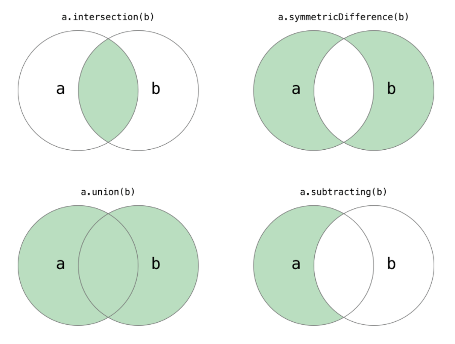

Sets(노트 박스는 무시 가능)
Performing Set Operations

• 배열(Array)의 초기화(initializers)에 대해서도 읽어두시기 바랍니다.

---

#### Mutability of Collections

#### Array
* 스위프트의 Array 타입은 Foundation의 NSArray class와 연결되어 있다.
* `Array<Element>`, `[Element]`
* Creating an Empty Array
```swift
var someInts = [Int]()
print("someInts is of type [Int] with \(someInts.count) items.")
// Prints "someInts is of type [Int] with 0 items."
```
* Creating an Array
```swift
var threeDoubles = Array(repeating: 0.0, count: 3) // [0.0, 0.0, 0.0]
var anotherThreeDoubles = Array(repeating: 2.5, count: 3)
var sixDoubles = threeDoubles + anotherThreeDoubles
// sixDoubles : [0.0, 0.0, 0.0, 2.5, 2.5, 2.5]

var shoppingList: [String] = ["Eggs", "Milk"] // literal
```
* `remove(at:)`-> count property로 위치 알아야함, 마지막 아이템 제거시엔 그냥 `removeLast()`메서드 사용
* `enumerated()`메서드 사용과 tuple
    ```swift
    var shoppingList = ["Six eggs", "Milk", "Flour", "Baking Powder", "Bananas"]

    for (index, value) in shoppinList.enumerated() {
      print("Item \(index + 1): \(value)")
    }
    // Item 1: Six eggs
    // Item 2: Milk
    // Item 3: Flour
    // Item 4: Baking Powder
    // Item 5: Bananas
    ```

#### Sets
* `Set<Element>`
* hashable type만 가능 : 스위프트의 basic type은 모두 hashable (String, Int, Double, Bool)
    - 추가적으로 set value type이나 dictionary key type으로 사용가능하고, Enumeration case value 또한 hashable이다.(연관값을 가지고 있지 않을 경우만)
* 타입은 스스로 해시값을 계산하는 방법을 제공해야한다. 해시 값은 모든 객체에 대해 같은지를 비교하는데 사용하는 Int값, a == b이면 a.hashValue == b.hashValue와 같다.
* Creating a Set
```swift
var letters = Set<Character>()
letters = [] // empty

var favoriteGenres: Set<String> = ["Rock", "Classical", "Hip Hop"]
// var favoriteGenres: Set = ["Rock", "Classical", "Hip Hop"] 와 같다. 모두 같은 타입이므로 Set만 명시해주면 나머진 추론

```
* remove 사용시 주의(옵셔널 바인딩)
    - remove메서드는 해당 값이 포함되어 있지 않으면 nil을 돌려줌
    ```swift
    var favoriteGenres: Set = ["Rock", "Classical", "Hip Hop"]

    if let removedGenre = favoriteGenres.remove("Rock") {
      print("\(removedGenre)? I'm over it.")
    } else {
      print("I never much cared for that.")
    }
    // "Rock? I'm over it."

    // 포함여부 확인
    if favoriteGenres.contains("Funk") {
      print("I get up on the good foot.")
    } else {
      print("It"s too funky in here.")
    }
    // "It"s too funky in here."
    ```
* Iterating Over a Set( + sorting)
```swift
for genre in favoriteGenres.sorted() {
    print("\(genre)")
}
```

#### Performing Set Operations
* Fundamental Set Operations
  

```swift
let oddDigits: Set = [1, 3, 5, 7, 9]
let evenDigits: Set = [0, 2, 4, 6, 8]
let singleDigitPrimeNumbers: Set = [2, 3, 5, 7]

oddDigits.union(evenDigits).sorted()
// [0, 1, 2, 3, 4, 5, 6, 7, 8, 9]
oddDigits.intersection(evenDigits).sorted()
// []
oddDigits.subtracting(singleDigitPrimeNumbers).sorted()
// [1, 9]
oddDigits.symmetricDifference(singleDigitPrimeNumbers).sorted()
// [1, 2, 9]

```
* Set Membership and Equality
  


#### Dictionaries
* `Dictionary<Key, Value>` 또는 `[Key: Value]`
* 딕셔너리의 key type은 hashable protocol을 준수해야한다.(like a set's value type)
* Creating
    ```swift
    var namesOfIntegers = [Int: String]()
    namesOfIntegers[16] = "sixteen"

    namesOfIntegers = [:] // empty, type [Int: String]

    // literal
    var airports: [String: String] = ["YYZ": "Toronto Pearson", "DUB": "Dublin"]
    // 또는 타입 명시 없어도 타입추론할 수 있다.
    var airports = ["YYZ": "Toronto Pearson", "DUB": "Dublin"]
    ```
* new item 추가하기
    ```swift
    airports["LHR"] = "London"
    // the airports dictionary now contains 3 items

    airports["LHR"] = "London Heathrow"
    // subscript 문법으로 값 수정하기
    ```
* `updateValue(_:forKey:)`메서드 위의 subscript 대안
    - 해당키에 값이 없으면 주는 값으로 set하거나, 있을 경우 값을 update한다.
    - update하고 old value를 반환한다.
    - update메서드의 반환값은 옵셔널이다.
    ```swift
    var airports: [String: String] = ["YYZ": "Toronto Pearson", "DUB": "Dublin"]
    airports["LHR"] = "London Heathrow"

    if let oldValue = airports.updateValue("Dublin Ariport", forKey: "DUB") {
        print("The old value for DUB was \(oldValue).")
    }
    // "The old value for DUB was \(oldValue)."
    ```
    - 위의 코드에서 nil값을 반환해도 update는 이루어진다.
* subscript로 딕셔너리의 특정 키에 대한 값 가져오기
```swift
if let airportName = airports["DUB"] {
    print("The name of the airport is \(airportName).")
} else {
    print("That airport is not in the airports dictionary.")
}
// Prints "The name of the airport is Dublin Airport."
```
* subscript로 remove하기
```swift
airports["APL"] = "Apple International"
// "Apple International" is not the real airport for APL, so delete it
airports["APL"] = nil
// APL has now been removed from the dictionary, APL에 대한 키와 value 모두 없어짐
```
* 대안 : `removeValue(forKey:)`, 마찬가지로 해당키에 대한 값이 없을 경우 nil을 반환하므로 반환값은 옵셔널
* iterating Over a Dictionary(튜플반환)
```swift
for (airportCode, airportName) in airports {
    print("\(airportCode): \(airportName)")
}
// YYZ: Toronto Pearson
// LHR: London Heathrow

```
* `keys`와 `values` 프로퍼티 사용
```swift
for airportCode in airports.keys {
    print("Airport code: \(airportCode)")
}
// Airport code: YYZ
// Airport code: LHR

for airportName in airports.values {
    print("Airport name: \(airportName)")
}
// Airport name: Toronto Pearson
// Airport name: London Heathrow
```
* Array 인스턴스 API로 딕셔너리의 키 또는 값이 필요한 경우
```swift
let airportCodes = [String](airports.keys)
// airportCodes is ["YYZ", "LHR"]

let airportNames = [String](airports.values)
// airportNames is ["Toronto Pearson", "London Heathrow"]
```
* 딕셔너리는 순서가 없으므로 sorted()메서드로 정렬가능
