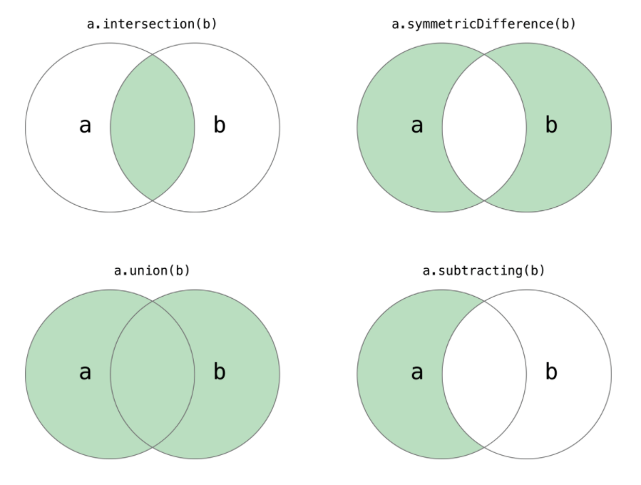
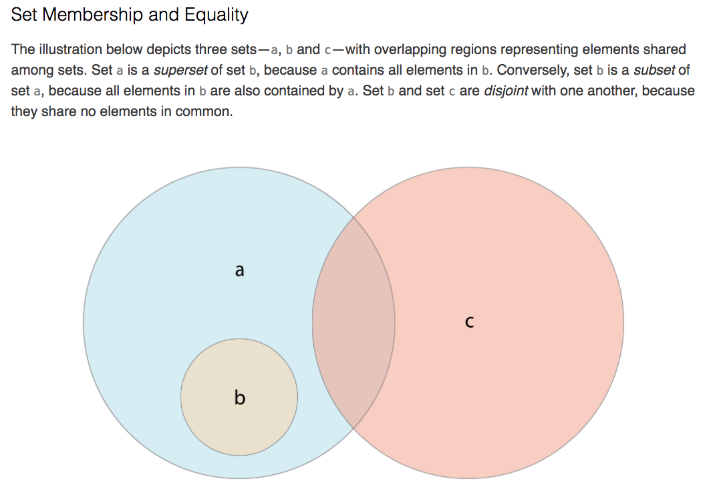

#### Mutability of Collections
array, set, dictionar소개
상수사용을 통해 추론이 쉬워지고 컴파일러가 성능을 올릴 수 있다.

#### Array
* 스위프트의 Array 타입은 Foundation의 NSArray class와 연결되어 있다.
* `Array<Element>`, `[Element]`
* Creating an Empty Array
```swift
var someInts = [Int]()
print("someInts is of type [Int] with \(someInts.count) items.")
// Prints "someInts is of type [Int] with 0 items."
```
* Creating an Array
```swift
var threeDoubles = Array(repeating: 0.0, count: 3) // [0.0, 0.0, 0.0]
var anotherThreeDoubles = Array(repeating: 2.5, count: 3)
var sixDoubles = threeDoubles + anotherThreeDoubles
// sixDoubles : [0.0, 0.0, 0.0, 2.5, 2.5, 2.5]

var shoppingList: [String] = ["Eggs", "Milk"] // literal
```
* `remove(at:)`-> count property로 위치 알아야함, 마지막 아이템 제거시엔 그냥 `removeLast()`메서드 사용
* `enumerated()`메서드 사용과 tuple
    ```swift
    var shoppingList = ["Six eggs", "Milk", "Flour", "Baking Powder", "Bananas"]

    for (index, value) in shoppinList.enumerated() {
      print("Item \(index + 1): \(value)")
    }
    // Item 1: Six eggs
    // Item 2: Milk
    // Item 3: Flour
    // Item 4: Baking Powder
    // Item 5: Bananas
    ```

#### Sets
Set는 정해진 순서가 없는 컬렉션에 같은 타입의 고유한 값을 저장한다.(중복되지 않는 value)
Note: 스위프트의 Set 타입은 Foundation의 NSSet 클래스와 연결되어있다(bridged).
* Hash Values for Set Types
    - Set에 저장하는 값들은 반드시 *hashable* 타입이어야 한다. 즉, 타입은 반드시 스스로 hash value를 계산하는 방법을 제공해야 한다. Hash value는 모든 객체에 대해서 같은 값인지 비교하는데 사용되는 Int값이다. 예를 들어 `a == b`라면 `a.hashValue == b.hashValue`를 따른다.
    - 스위프트의 기본타입(`String, Int, Double, Bool`)은 모두 hashable 타입이며 Set value type과 dictionary key type으로 사용가능하다. 열거형 케이스 값도 *연관값* 이 없다면 기본적으로 hashable.
    - 해시 가능한 값 = 스위프트 표준라이브러리에 Hashable 프로토콜을 따른다는 것을 의미 (스위프트 프로그래밍[야곰 저] 92 page)
* Set Type Syntax
    - `Set<Element>`, Set은 배열과 달리 축약형을 갖고 있지 않다.
* Creating and Initializing an Empty Set
    - 이니셜라이저 문법을 사용한 생성
        ```swift
        var letters = Set<Character>()
        print("letters is of type Set<Character> with \(letters.count) items.")
        // 0 items, letters is inferred to be Set<Character> from the type of the initilizer
        ```
    - 만약에 이미 문맥에서 타입에 대한 정보를 제공하고 있다면(function argument라든지 변수나 상수의 타입을 이미 정했다면), empty array literal을 사용할 수 있다.
        ```swift
        letters.insert("a")
        // letters - ["a"], 타입은 character
        letters = []
        // letters은 Set []
        ```
* Creating a Set with an Array Literal
    ```swift
    var favoriteGenres: Set<String> = ["Rock", "Classical", "Hip hop"]
    ```

    - Set타입은 array literal만으로 타입추론을 할 수 없다. 반드시 Set의 명시적인 선언이 필요하다. 하지만 스위프트의 타입 추론 때문에 Set의 타입은 생략할 수 있다.

    > var favoriteGenres: Set = ["Rock", "Classical", "Hip hop"]

* Accessing and Modifying a Set
    - `count`, `isEmpty` 프로퍼티 설명(isEmpty는 count 프로퍼티가 0 인지 아닌지 확인하는 Boolean 타입이다.)
    - 아이템추가 : `insert(_:)`메서드
    - 아이템제거 : `remove(_:)`메서드 (반환값: 제거된 value, 만약에 포함하고 있지 않다면 nil 반환), 전부 삭제할 때 : `removeAll()`
        ```swift
        if let removedGenre = favoriteGenres.remove("Rock") {
          print("\(removedGenre)? I'm over it.")
        } else {
          print("I never much cared for that")
        }
        ```
    - 포함여부 확인 : `contains(_:)` 메서드
        ```swift
        if favoriteGenres.contains("Funk") {
          print("I get up on the good foot.")
        } else {
          print("It's too funky in here.")
        }
        ```

* Iterating Over a Set
    ```swift
    for genre in favoriteGenres {
    print("\(genre)")
    }
    ```
    - 정렬을 사용하고 싶을 때 : `sorted()`메서드
    ```swift
    for genre in favoriteGenres.sorted() {
      print("\(genre")
    }
    ```

#### Performing Set Operations
* Fundamental Set Operations
  

```swift
let oddDigits: Set = [1, 3, 5, 7, 9]
let evenDigits: Set = [0, 2, 4, 6, 8]
let singleDigitPrimeNumbers: Set = [2, 3, 5, 7]

oddDigits.union(evenDigits).sorted()
// [0, 1, 2, 3, 4, 5, 6, 7, 8, 9]
oddDigits.intersection(evenDigits).sorted()
// []
oddDigits.subtracting(singleDigitPrimeNumbers).sorted()
// [1, 9]
oddDigits.symmetricDifference(singleDigitPrimeNumbers).sorted()
// [1, 2, 9]

```
* Set Membership and Equality
  
    * `==` : 포함하고 있는 value들이 전부 같은지
    * `isSubset(of:)` : 세트가 주어진 세트의 subset인지
    * `isSuperset(of:)` : 세트가 주어진 세트의 superset인지
    * `isStrictSubset(of:)` or `isStrictSuperset(of:)` : superset이나 subset이지만 서로 같으면 안된다
    * `isDisjoint(with:)` : 공유하는 value가 없음

#### Dictionaries
* `Dictionary<Key, Value>` 또는 `[Key: Value]`
* 딕셔너리의 key type은 hashable protocol을 준수해야한다.(like a set's value type)
* Creating
    ```swift
    var namesOfIntegers = [Int: String]()
    namesOfIntegers[16] = "sixteen"

    namesOfIntegers = [:] // empty, type [Int: String]

    // literal
    var airports: [String: String] = ["YYZ": "Toronto Pearson", "DUB": "Dublin"]
    // 또는 타입 명시 없어도 타입추론할 수 있다.
    var airports = ["YYZ": "Toronto Pearson", "DUB": "Dublin"]
    ```
* new item 추가하기
    ```swift
    airports["LHR"] = "London"
    // the airports dictionary now contains 3 items

    airports["LHR"] = "London Heathrow"
    // subscript 문법으로 값 수정하기
    ```
* `updateValue(_:forKey:)`메서드 위의 subscript 대안
    - 해당키에 값이 없으면 주는 값으로 set하거나, 있을 경우 값을 update한다.
    - update하고 old value를 반환한다.
    - update메서드의 반환값은 옵셔널이다.
    ```swift
    var airports: [String: String] = ["YYZ": "Toronto Pearson", "DUB": "Dublin"]
    airports["LHR"] = "London Heathrow"

    if let oldValue = airports.updateValue("Dublin Ariport", forKey: "DUB") {
        print("The old value for DUB was \(oldValue).")
    }
    // "The old value for DUB was \(oldValue)."
    ```
    - 위의 코드에서 nil값을 반환해도 update는 이루어진다.
* subscript로 딕셔너리의 특정 키에 대한 값 가져오기
```swift
if let airportName = airports["DUB"] {
    print("The name of the airport is \(airportName).")
} else {
    print("That airport is not in the airports dictionary.")
}
// Prints "The name of the airport is Dublin Airport."
```
* subscript로 remove하기
```swift
airports["APL"] = "Apple International"
// "Apple International" is not the real airport for APL, so delete it
airports["APL"] = nil
// APL has now been removed from the dictionary, APL에 대한 키와 value 모두 없어짐
```
* 대안 : `removeValue(forKey:)`, 마찬가지로 해당키에 대한 값이 없을 경우 nil을 반환하므로 반환값은 옵셔널
* iterating Over a Dictionary(튜플반환)
```swift
for (airportCode, airportName) in airports {
    print("\(airportCode): \(airportName)")
}
// YYZ: Toronto Pearson
// LHR: London Heathrow

```
* `keys`와 `values` 프로퍼티 사용
```swift
for airportCode in airports.keys {
    print("Airport code: \(airportCode)")
}
// Airport code: YYZ
// Airport code: LHR

for airportName in airports.values {
    print("Airport name: \(airportName)")
}
// Airport name: Toronto Pearson
// Airport name: London Heathrow
```
* Array 인스턴스 API로 딕셔너리의 키 또는 값이 필요한 경우
```swift
let airportCodes = [String](airports.keys)
// airportCodes is ["YYZ", "LHR"]

let airportNames = [String](airports.values)
// airportNames is ["Toronto Pearson", "London Heathrow"]
```
* 딕셔너리는 순서가 없으므로 sorted()메서드로 정렬가능
